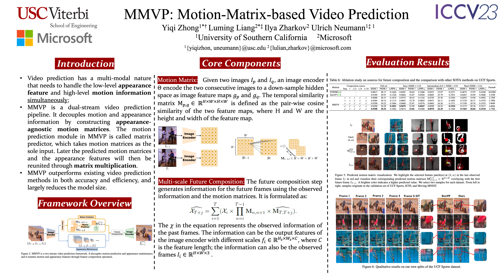

# MMVP: Motion-Matrix based Video Prediction
## [arXiv](https://arxiv.org/abs/2308.16154)



```bash
git clone https://github.com/Kay1794/MMVP-motion-matrix-based-video-prediction.git
cd MMVP-motion-matrix-based-video-prediction
conda env create -f environment.yml
```

### Data Preparation
MMVP has been tested on three datasets: [UCF Sports](https://www.crcv.ucf.edu/data/UCF_Sports_Action.php), [KTH](https://www.csc.kth.se/cvap/actions/) and [Moving MNIST](https://www.cs.toronto.edu/~nitish/unsupervised_video/)

Please feel free to download our pre-processed dataset:

[UCF Sports MMVP split](https://drive.google.com/drive/folders/12-edQGEKGf6d6mjiiKPF0X0v3ugQwyUM?usp=drive_link); 

[UCF Sports STRPM split](TBD); 

[KTH](https://drive.google.com/drive/folders/1QXWveHrLzpFeqeSPjLuBqw9ZZzOIDnws?usp=drive_link); 

[Moving MNIST](https://drive.google.com/drive/folders/1UhMxaP9sAybpqQBR5u6pLL3EPXVN-wrX?usp=drive_link).

The final data folder `PATH_TO_DATASET` should be organized like this:

```
PATH_TO_DATASET
├── ucf_ours
│   ├──ucf_prediction_4to1_filter_easy_test  
│   ├──ucf_prediction_4to1_filter_intermediate_test  
│   ├──ucf_prediction_4to1_filter_train
│   ├──ucf_prediction_4to1_filter_hard_test  
│   └──ucf_prediction_4to1_filter_test 
│   │   ├──XXX.npy
│   │   └──...
├── kth
│   ├──test_indices_gzip.hkl       
│   ├──train_data_gzip_t=40.hkl
│   ├──test_data_gzip.hkl       
│   ├──test_indices_gzip_t=40.hkl  
│   ├──train_indices_gzip.hkl
│   ├──test_data_gzip_t=40.hkl  
│   ├──train_data_gzip.hkl         
│   └──train_indices_gzip_t=40.hkl
├── moving-mnist
│   ├── mnist_test_seq.npy  
│   └── train-images-idx3-ubyte.gz
├── ucf_strpm
    └── ...
```

Please modify PATH_TO_DATASET in config.py to your own dataset root. 

### Run
Please add --use_direct_predictor for kth and moving-mnist dataset
#### Training

```bash
python main.py --exp EXP_NAME --base_channel 16 --pred_base_channel 8 --mode train --dataset ucf_4to1 --rot_aug --flip_aug --cos_restart --t_period 50 --nepoch 50 --loss_list recon --batch 3 --logpath ./results/ --filter_block --scale_in_use 3 --res_cat_img --downsample_scale 2 4 2 --lr 1e-3 --log
```

#### Validation 
```bash
python main.py --exp EXP_NAME --base_channel 16 --pred_base_channel 8 --mode val --dataset ucf_4to1 --rot_aug --flip_aug --cos_restart --t_period 50 --nepoch 50 --loss_list recon --batch 3 --logpath ./results/ --filter_block --scale_in_use 3 --res_cat_img --downsample_scale 2 4 2 --lr 1e-3 --log --resume PATH_TO_PTH_FILE
```